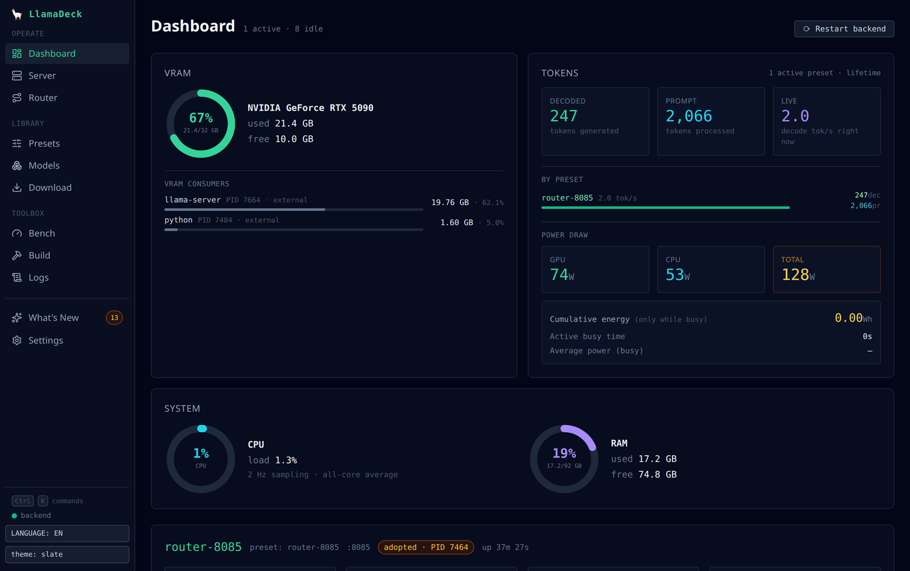
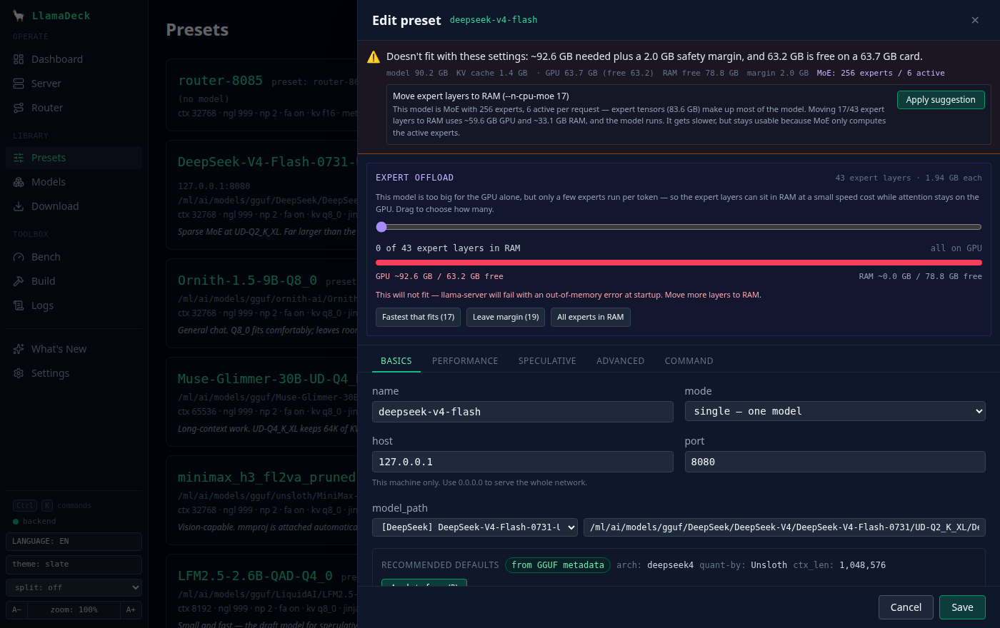
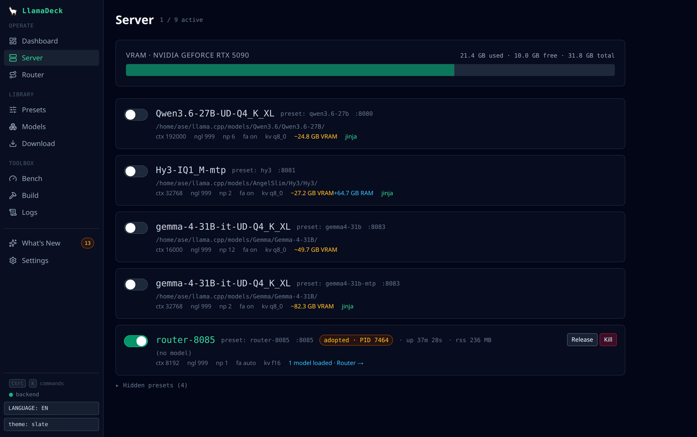
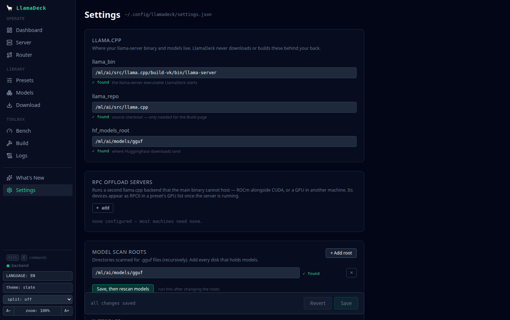
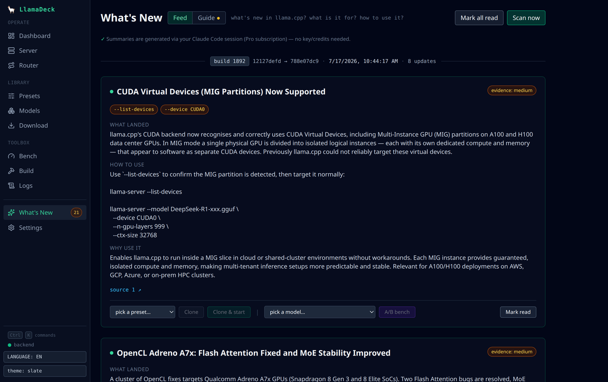

# 🦙 LlamaDeck

**The control deck for [llama.cpp](https://github.com/ggml-org/llama.cpp) — Ollama's convenience, llama.cpp's control, hiding nothing.**

LlamaDeck is a web UI + REST API + MCP server that manages `llama-server` for you: process lifecycle, presets, one-click HuggingFace GGUF downloads, a live metrics dashboard, VRAM fit-checking, llama.cpp builds, benchmarking — and agent-driven model swapping over MCP.



<!-- TODO: hero GIF — record with e.g. `peek` or `wf-recorder`: start a preset,
     watch live t/s sparklines, run a fit-check, then let an MCP agent swap models. -->

## Why?

Running `llama-server` directly gives you the best performance and full control over every flag — but managing it from the CLI means hand-rolled shell scripts, guessing VRAM budgets, and juggling ports. LlamaDeck keeps the raw llama.cpp underneath (your flags, your binary, your ports) and adds the operations layer on top:

|  | LlamaDeck | llama-swap | Ollama | llama-server router |
|---|---|---|---|---|
| Web dashboard (live t/s, slots, KV cache, VRAM) | ✅ | partial | ❌ | ❌ |
| UI-managed presets (no YAML) | ✅ | ❌ | ❌ | partial |
| VRAM fit-check before launch (incl. MoE CPU-offload advice) | ✅ | ❌ | ❌ | ❌ |
| HuggingFace GGUF search + one-click download | ✅ | ❌ | ✅ | ❌ |
| llama.cpp build/update from source | ✅ | ❌ | ❌ | ❌ |
| A/B benchmarking | ✅ | ❌ | ❌ | ❌ |
| MCP server — agents manage models themselves | ✅ | ❌ | ❌ | ❌ |
| Process-level isolation per model | ✅ | ✅ | ❌ | ✅ |
| Raw llama-server flags, unmodified binary | ✅ | ✅ | ❌ | ✅ |

## Requirements

- **OS:** Linux or macOS (Apple Silicon and Intel). Windows is untested — the process handling is cross-platform, but nothing else is verified there; WSL2 is the safe path.
- **Desktop icon:** Linux only. `scripts/install-desktop.sh` and the launcher behind it are XDG-specific — a `.desktop` entry, `xdg-open`, a Chromium binary on `PATH`, and a terminal emulator from a known list. On macOS the app itself runs (Metal builds, unified-memory budgeting and the fit-check all work); you start it with `uv run llamadeck serve` and open the URL yourself. The launcher detects a non-Linux system and says exactly that rather than failing quietly.
- **Python:** 3.11+ (`uvx`/`pipx` handle this for you).
- **llama.cpp:** not required up front. The setup wizard finds a `llama-server` you already have (`PATH`, `brew install llama.cpp`, an [official release](https://github.com/ggml-org/llama.cpp/releases)), or clones and builds one for you. Building needs `git`, `cmake` and a C++ compiler — the wizard names the missing package if you don't have them.
- **GPU:** optional — everything works CPU-only.

### Hardware support

| | Memory panel | Power | Build backend | Fit-check |
|---|---|---|---|---|
| **NVIDIA** (Linux) | `nvidia-smi`, per-process VRAM | GPU + CPU (RAPL) | CUDA | VRAM vs RAM budgets |
| **Apple Silicon** | unified memory, sized by the Metal wired limit | — (`powermetrics` needs root) | Metal (default) | one shared pool; warns when the model exceeds `iogpu.wired_limit_mb` |
| **AMD** (Linux, amdgpu) | VRAM + GTT from sysfs | GPU rail + CPU (RAPL) | HIP/ROCm (auto-pins `AMDGPU_TARGETS`) or Vulkan | APUs (Ryzen AI Max / Strix Halo) treated as one shared pool |
| **CPU only** | hidden | CPU (RAPL, Linux) | CPU | plans against system RAM |

The Build page detects which toolchains are actually installed and defaults to
**auto**, so a rebuild picks CUDA, Metal, HIP or Vulkan without you telling it
which machine you're on. Switching backends wipes the stale cmake cache for you.

## Quick start

```bash
uvx llamadeck serve          # or: pipx install llamadeck && llamadeck serve
```

Open `http://127.0.0.1:8770`. A fresh install lands on the setup wizard, which takes a machine with nothing on it to a running model:

1. **llama.cpp** — uses a `llama-server` you already have, or clones and builds one. The compute backend defaults to *auto*: CUDA, Metal, HIP or Vulkan, whichever your machine can actually build. The clone and build stream their log into the page, and the resulting binary is wired into settings for you.
2. **Models folder** — where GGUFs live. Created if it doesn't exist, and registered as a scan root.
3. *(optional)* **A model** — download one from HuggingFace, or copy in GGUFs you already have and hit rescan.
4. *(optional)* **A preset** — the preset wizard fills in the flags from the model and what you want it for.

Only the first two are prerequisites; once they're set the wizard says so and stops asking. Plenty of people arrive with their models already on an external disk, and an installer that insists on downloading one is just in the way.

Every step re-checks the real thing rather than remembering that you clicked it, so moving your binary later brings the step back instead of pretending the machine is ready. If you'd rather set the paths by hand, *Settings → llama.cpp paths* still does exactly what it always did.

### From source

```bash
git clone https://github.com/vectorweft/llamadeck && cd llamadeck
uv sync
(cd frontend && npm install && npm run build)   # outputs to backend/lld/static/
uv run llamadeck serve
```

## A look around

**Fit-check answers "will this actually run?" before you hit start** — it parses the GGUF, adds up weights + KV cache + compute buffers, compares that against what the GPU has free *right now*, and suggests the fix (`--n-cpu-moe N`, KV quantization, smaller context) instead of letting the load OOM:



**The Server page is the process view** — start/stop toggles, adopt an externally-started llama-server, per-preset VRAM estimates that account for CPU-offloaded experts, and a link into a running router's loaded models:



**Settings validates your paths as you type**, so a typo shows up here rather than as a mysterious empty Models page:



**What's New turns each llama.cpp rebuild into a briefing.** After a build, LlamaDeck diffs the new binary's `--help` against the previous one (deterministic — the flag provably exists), pulls the commit range from GitHub, and has Claude write cards explaining what landed, how to use it, and why you'd care. Cards you can act on: clone a preset with the new flags, or A/B benchmark them:



## Features

- **Bilingual UI (EN/TR)** — one-click language toggle in the header. English by default; Turkish covers the full UI, fit-check messages, and even the AI-generated What's New cards and build guide. Untranslated strings fall back to English gracefully.
- **Presets** — every llama-server flag as a form field, grouped and documented; port ownership, hidden presets, router-mode presets. No YAML.
- **Fit-check** — before you launch, LlamaDeck parses the GGUF, estimates weights + KV cache + compute buffers against free VRAM, and suggests fixes (`--n-cpu-moe N` for MoE models, KV quantization, smaller context) instead of letting you OOM.
- **Dashboard** — per-preset live tokens/sec sparklines, slot occupancy, KV cache usage, VRAM donut, uptime; SSE-streamed at 2 Hz.
- **Downloads** — search HuggingFace, classify repos (model vs mmproj vs draft), pick a quant, download with progress + resume.
- **Router mode** — manage llama-server's multi-model router: alias INI auto-generated from your presets, restart-free model swap.
- **Page-cache pre-warm** — when a model with `--n-cpu-moe N` (MoE weights in system RAM) finishes loading, LlamaDeck warms the exact byte ranges of the CPU-offloaded expert tensors into the page cache. Without it, a cold page cache makes every decode step read expert weights from disk (measured: ~1 t/s vs ~19 t/s on a 96 GiB DeepSeek on an 89 GiB box).
- **Build** — update and rebuild llama.cpp from source from the browser: pick the compute backend (auto / CUDA / Metal / HIP / Vulkan / CPU — only the ones your machine can actually build), job count, build history.
- **Bench** — A/B benchmark presets or flag variations; results stored in SQLite.
- **MCP server** — 30+ tools (`start_preset`, `switch_preset`, `wait_until_ready`, `hf_download`, `get_vram`, `bench_run`, `llama_backends`, …) so a Claude/MCP agent can pick, download, and launch the right model for its own task. See [docs/vram-swapping.md](docs/vram-swapping.md) for a worked example: an agent time-sharing one GPU between the LLM and ComfyUI.
- **OpenAI-compatible proxy** — downstream apps keep talking to one URL while models swap underneath.
- **GPU broker** — arbitrates VRAM between the LLM and other GPU workloads (ComfyUI, TTS) with leases and keep-alive.

## Architecture

- `backend/lld/` — FastAPI app, asyncio process supervisor, SQLite persistence, MCP server (import package: `lld`)
- `frontend/` — SvelteKit SPA, served as a static build by FastAPI
- `~/.config/llamadeck/` — XDG state: settings.json, presets.json, SQLite DB, logs

LlamaDeck itself listens on `127.0.0.1:8770` and never binds `:8080` — your `llama-server` instances keep their ports, so existing clients keep working unchanged.

## Security

LlamaDeck binds to localhost by default and has no authentication. It can start and stop processes on your machine — do not expose it to untrusted networks. LAN access can be gated with `lan_token` in settings.

The `llama-server` processes LlamaDeck starts also bind `127.0.0.1` by default, since they serve completions with no auth of their own. To reach a model from another machine, set that preset's *host* to `0.0.0.0` deliberately — and put it behind something that authenticates.

## License

[MIT](LICENSE)
